<picture>
  <source media="(prefers-color-scheme: dark)" srcset="./assets/hero-dark.svg">
  
</picture>

#### Core

  

#### Expanding

 

 

<picture>
  <source media="(prefers-color-scheme: dark)" srcset="https://github-readme-stats.vercel.app/api?username=TransparentDeveloper&show_icons=true&hide_border=true&bg_color=0B1220&title_color=38BDF8&icon_color=22D3EE&text_color=94A3B8&ring_color=38BDF8">
  
</picture> <picture>
  <source media="(prefers-color-scheme: dark)" srcset="https://github-readme-stats.vercel.app/api/top-langs/?username=TransparentDeveloper&layout=compact&langs_count=8&hide_border=true&bg_color=0B1220&title_color=38BDF8&text_color=94A3B8">
  
</picture>

<picture>
  <source media="(prefers-color-scheme: dark)" srcset="https://raw.githubusercontent.com/TransparentDeveloper/TransparentDeveloper/output/github-snake-dark.svg">
  
</picture>

#### 최신 벨로그 게시글
<!-- VelogPostsStart -->

1. <a href="https://velog.io/@sksmsdbstlsdlek/%EB%9D%BC%EC%9D%B4%EB%B8%8C%EB%9F%AC%EB%A6%AC-%EC%B2%B4%ED%97%98%EA%B8%B0-FxTS" target="_blank">라이브러리 체험기 - FxTS</a>
2. <a href="https://velog.io/@sksmsdbstlsdlek/CICD-%EC%99%80-Github-Action" target="_blank">CI/CD 와 Github Action</a>
3. <a href="https://velog.io/@sksmsdbstlsdlek/NPM-%EC%97%90-%EB%B0%B0%ED%8F%AC%ED%95%98%EA%B8%B0-Module-System-%EC%9D%B4%ED%95%B4%EC%99%80-package.json-%EC%84%A4%EC%A0%95" target="_blank">NPM 에 배포하기 - ①, Module System 이해와 package.json 설정</a>
4. <a href="https://velog.io/@sksmsdbstlsdlek/%EC%A3%BC%EA%B4%80%EC%A0%95%EB%A6%AC-%EC%9C%A0%ED%8B%B8%EB%A6%AC%ED%8B%B0-%ED%95%A8%EC%88%98-%EA%B4%80%EB%A6%AC-fw0vqp2p" target="_blank">[주관정리] - 유틸리티 함수 관리</a>

<!-- VelogPostsEnd -->